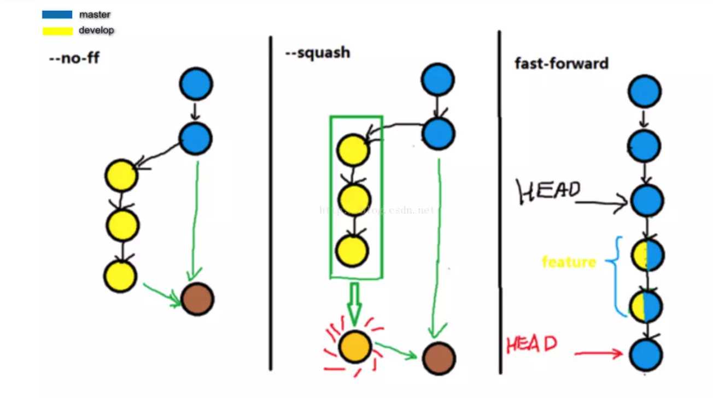
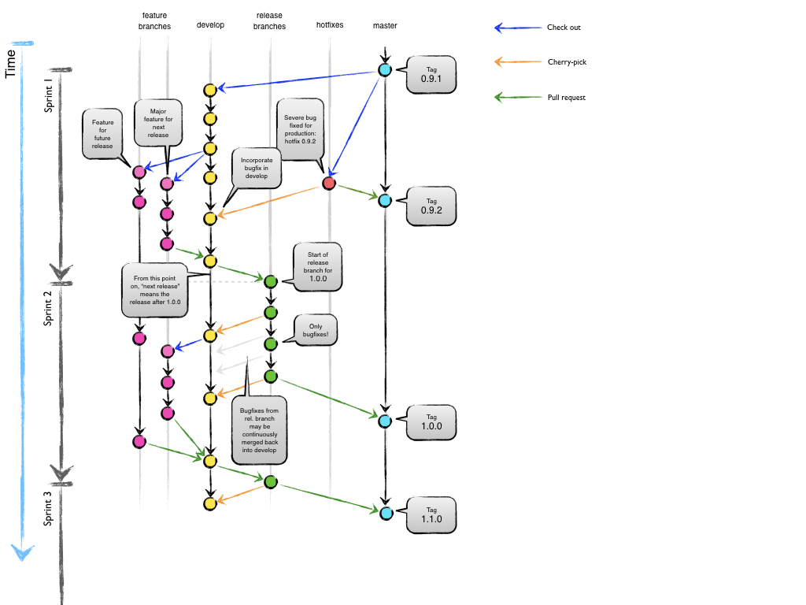

# Select Team Git Guidelines

## Repo management

> All select repos are now managed via TF. All repo creation will happen via Terraform in the Infrastructure monorepo.
> [https://github.com/LiveRamp/infrastructure](https://github.com/LiveRamp/infrastructure)

You can see these files under `infrastructure / select / github /`:

```bash
main.tf
select_apac_repository.tf
select_b2b_repository.tf
select_core_repository.tf
select_tv_repository.tf
select_vm_repository.tf
```

We have divided different `.tf` files by team, so please create resources in your own team file.

### Create Repo

1: Build your terraform script

```bash
# pull code
git pull git@github.com:LiveRamp/infrastructure.git infrastructure
# goto code folder
cd infrastructure
# make sure in master branch
git checkout master
# make sure the latest version of the code
git pull origin master
# build a branch to develop
git checkout -b new-repo-name
# add your code
# ...
git commit -a "feat:create new repo for ..."

git push origin new-repo-name
```

2: Create a `Draft PR`

You could create a `Draft PR` by selecting the drop down when you add description for the change instead of clicking on `Create Pull Request`. This way, you can keep iterating before requesting review and no one in your team will be notified by email until you mark it `Ready for Review`.

3: Test your code

After you submit the PR, `atlantis plan` will run automatically. If you encounter `Plan Error` please check the `Show Output` of `atlantis plan` in the comments. If `atlantis plan` is successful and the `Show Output` as your expected, then you can make PR to `Ready for Review`.

**Note**: Please add the `lable` to your PR, select through `Lables` on the right of page.

4: Apply your code

Usually, after your PR has been approved by a reviewer, you can run `atlantis apply -p select-github` to create resource. However, we recommend that your PR should be reviewed by **your Lead** and **SRE APAC team members** before it can be applied.
The code will be merged automatically after `atlantis apply` run successfully.

### Pull Request

You will see below questions when open a pull request.

```md
<!-- Describe your changes above, then answer the below questions. -->

### Change information
<!-- Is there a JIRA ticket for this change? If not, set to 'none'. -->
* JIRA ticket: <!-- ticket_id_here: https://liveramp.atlassian.net/browse/ -->
<!-- What was your testing process? If nothing, explain why. -->
* Testing Done: <!-- Describe here -->
<!-- Can someone else apply this change for you once ready? -->
* Anyone can apply it: <!-- Yes or No -->
<!-- Link to documentation that should change or has changed as a result of this ticket, if any. -->
* Documentation added: <!-- Describe here -->
```

It is often necessary to ensure that `Testing Done` and `Anyone can apply it` these two answers are accurate.

### Permissions

- For terraform scripts, everyone has the same write permissions.
- For repos, we have set up a management group for each team. If you need `admin` permissions, please apply to your lead. **Usually, you should not need it, `write` is enough.**

## Git usage guidelines

- It is recommended that most operations are performed in the terminal, such as `pull`, `push`, `commit`, `checkout`, etc.
- Any code merged into a fixed branch needs to submit a `pull request`, and need to go through a `code review`.
- It is recommended that create a `draft pull request` for review by yourself first，then requesting a review by another member.
- The merge flow `develop -> release -> master/tag` should be applied by the project owner. Each project will have two owners.
- When merging code from `feature` to `develop`, it is recommended to use `squash merge` or `merge --no-ff`.
- When merging code from `develop` to `feature`, it is recommended to use `rebase merge`.
- When merging code from `develop` to `release`, it is recommended to use `squash merge` or `merge --no-ff`.
- For a feature with a timespan greater than 2 days, you need to sync the `develop` branch to your `feature` branch every 2 days.
- The `hotfix` need to `cherry-pick` to the `develop` branch and `release` branch(if exists).
- The `release` branch is used for `QA`, `CERT` and `PROD`. After deployed, need to merge `release` branch to `master` branch and create a `tag`.

### Merge introduction



### Git flowchart



### Branch management

For each repo, we mainly use 2 persist branches (`master`,` develop`) and 3 temporary branches (`feature`,` release`, `hotfix`).

#### `master` branch

The master branch always keeps the latest release code. We will not develop features based on this branch.

#### `develop` branch

We develop new features based on the develop branch, and you should creates a feature branch based on the develop branch for developing.

#### `feature` branch

When developing a new feature, you need to create a feature branch based on develop branch. We use Jira for task management, so we can use Jira ID as the feature branch name, such as SELECT-2263.
For features longer than 2 days, it is recommended to sync develop branch to feature branch every 2 days to avoid major conflicts when branch merging.
Before committing your code to the develop branch, please confirm 3 things:

- This feature is tested.
- The unit test coverage of this feature is greater than 50%.
- The code of this feature follows the code specification.

#### `release` branch

release 为预上线分支，QA 会使用 release 分支代码为基准进行测试和发布。
每次 sprint 结束时，project owner 会基于 develop 分支创建用于 QA 测试的 release 分支。正式发布 release 后，需要将 release 的代码推送到 master 分支并创建版本 tag。
release 分支的命名基于`版本号规范`执行，release 分支在测试时可以存在多个版本，正式发布后需要合并到 master 分支。
> 示例：
> 如当前需要在 QA 测试 2.4.0 的代码，则从 develop 创建的 release 分支名称为：release-2.4.0。
> 当 release-2.4.0 正式发布后推送代码到 master，并基于 master 创建 tag v2.4.0。

#### `hotfix` branch

线上出现紧急问题时，基于对应版本 tag 创建 hotfix 分支进行代码修复。完成修复后需要合并代码到 develop 分支，并创建一个包含`新修正版本号`的 tag 分支。
如其它 tag 发现有同样问题，则需要从目标 tag 建立分支，然后 `cherry-pick` hotfix 的代码到 tag 代码进行修复，并生成一个包含`新修正版本号`的 tag 分支。
> 示例：
> 2.4.0 的线上代码发现有 bug，则基于 tag v2.4.0 创建 hotfix-2.4.0 临时分支进行修复。修复完成 cherry-pick 修复代码到 develop，并创建新的 tag v2.4.1。
> 如果在修复期间已经存在 release-2.5.0，代码同样存在 bug，则 cherry-pick 修复代码的 commit 到 release-2.5.0。

### 版本号规范

规范：`主版本号 . 子版本号 . 修正版本号 [ 版本号修饰词 ]`

- 主版本号：第一个数字，产品改动较大，可能无法向后兼容（要看具体项目）。
- 子版本号：第二个数字，增加了新功能，向后兼容。
- 修正版本号：第三个数字，修复 bug 或优化代码，一般没有添加新功能，向后兼容。

例如：

- 1.0
- 2.14.0
- 3.2.1 build-354

版本号修饰词：

- alpha: 内部测试版本，bug 较多，一般用于开发人员内部交流。
- beta: 测试版，bug 较多，一般用于热心群众测试，并向开发人员反馈。
- rc: release candidate，即将作为正式版发布，正式版之前的最后一个测试版。
- ga：general availability，首次发行的稳定版。
- r/release/ 或干脆啥都不加：最终释放版。
- lts: 长期维护，官方会指定对这个版本维护到哪一年，会修复所有在这个版本中发现的 BUG。

版本号管理策略：

- 项目初始版本号可以是 0.1 或 1.0。
- 项目进行 BUG 修正时，修正版本号加 1。
- 项目增加部分功能时，子版本号加 1，修正版本号复位为 0。
- 项目有重大修改时，主版本号加 1。

### Commit messages规范

> 为保证团队合作的高效性，Select team 需要遵循可读友好的 commit messages 日志规范。Repo 后面会实现基于 Github 的 webhook 实现对 commit messages 的自动检查，自动reject 不符合 commit 规范的 pull request。

Commit messages 格式要求: `{Type}:{50个字符以内，描述主要变更内容}`，
具体的Type类别说明：

- feat: 添加新特性。
- fix: 修复 bug。
- docs: 仅仅修改了文档。
- style: 仅仅修改了空格、格式缩进、都好等等，不改变代码逻辑。
- refactor: 代码重构，没有加新功能或者修复 bug。
- perf: 增加代码进行性能测试。
- test: 增加测试用例。
- chore: 改变构建流程、或者增加依赖库、工具等。
- revert: 撤销。
- close: 关闭 issue。
- release: 发布版本。

### 发布流程

基于 `develop -> release -> master/tag`的推送流进行版本发布管理：

- `develop` 分支用于 Dev 进行开发和测试。
- `release` 分支用于 QA/Cert/Prod 及 bugfix。
- `master/tag` 分支用于产品 hotfix。
